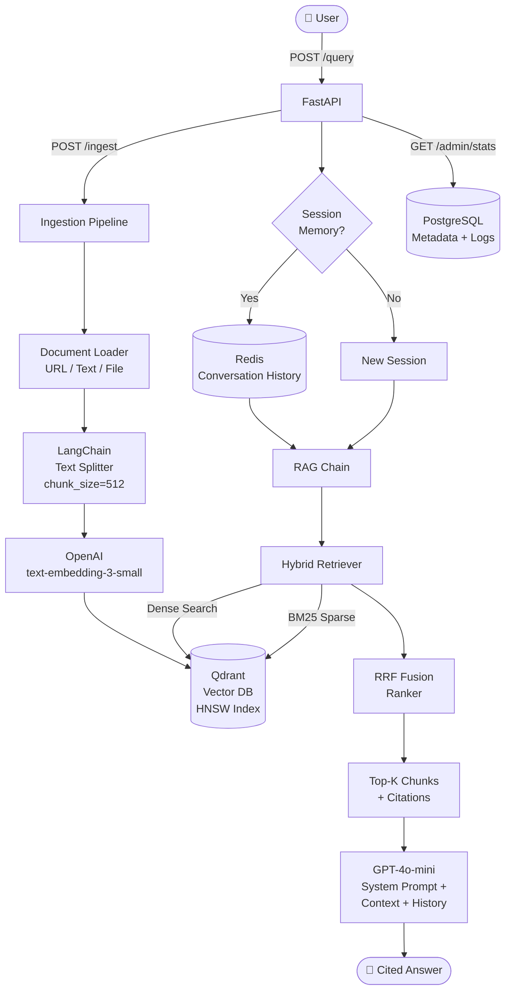

# 📚 Support Docs Copilot


> **Production-grade RAG documentation assistant.** Ask natural language questions over your docs and get grounded, cited answers with conversation memory — powered by Qdrant hybrid search and GPT-4o-mini.

---

## Architecture



### How It Works

| Step | Component | Description |
|------|-----------|-------------|
| **Ingest** | `POST /api/v1/ingest/` | Loads docs from URL or raw text, splits into 512-char chunks with 64-char overlap |
| **Embed** | OpenAI `text-embedding-3-small` | Each chunk → 1536-dim vector, upserted into Qdrant |
| **Retrieve** | Hybrid (Dense + BM25) | Dense cosine similarity + BM25 keyword search, fused via RRF (α=0.7) |
| **Generate** | GPT-4o-mini | Answers grounded strictly in retrieved context, with inline `[source: file]` citations |
| **Memory** | Redis | Last 3 conversation turns injected as history per session (TTL: 1 hr) |
| **Admin** | `GET /admin/stats` | Live chunk count, collection size, query volume from Qdrant + PostgreSQL |

---

## Project Structure

```
support-docs-copilot/
├── src/
│   ├── main.py              # FastAPI app + lifespan
│   ├── config.py            # Pydantic settings
│   ├── api/routes/
│   │   ├── ingest.py        # POST /ingest
│   │   ├── query.py         # POST /query
│   │   └── admin.py         # GET /admin/stats
│   ├── core/
│   │   ├── ingestion.py     # Load → chunk → embed → upsert
│   │   ├── embedder.py      # OpenAI async embeddings
│   │   ├── retriever.py     # Hybrid RRF retrieval
│   │   ├── rag_chain.py     # Memory + generation
│   │   └── vector_store.py  # Qdrant init
│   └── models/schemas.py    # Pydantic request/response
├── tests/test_rag.py
├── docker-compose.yml       # API + Qdrant + Redis
├── Dockerfile
└── requirements.txt
```

---

## Quick Start

```bash
git clone https://github.com/Gdhanush-13/support-docs-copilot
cd support-docs-copilot
cp .env.example .env          # set OPENAI_API_KEY
docker-compose up -d          # starts Qdrant + Redis
pip install -r requirements.txt
uvicorn src.main:app --reload
```

Swagger UI → `http://localhost:8000/docs`

---

## API Reference

| Method | Endpoint | Description |
|--------|----------|-------------|
| `POST` | `/api/v1/ingest/` | Ingest document from URL or text |
| `POST` | `/api/v1/query/` | Ask a question, get cited answer |
| `GET` | `/api/v1/admin/stats` | Collection + query statistics |
| `DELETE` | `/api/v1/admin/collection` | Reset vector collection |
| `GET` | `/health` | Health check |

```bash
# Ingest
curl -X POST http://localhost:8000/api/v1/ingest/ \
  -H "Content-Type: application/json" \
  -d '{"source_url": "https://docs.example.com/api.md"}'

# Query
curl -X POST http://localhost:8000/api/v1/query/ \
  -H "Content-Type: application/json" \
  -d '{"question": "How do I reset my password?", "top_k": 5}'
```

---

## Tech Stack

| Layer | Technology |
|-------|------------|
| API | FastAPI + Uvicorn |
| Vector DB | Qdrant (HNSW, cosine) |
| Embeddings | OpenAI text-embedding-3-small |
| LLM | GPT-4o-mini |
| Memory | Redis (session TTL) |
| Chunking | LangChain RecursiveTextSplitter |
| CI/CD | GitHub Actions |
| Containers | Docker Compose |

## Tests
```bash
pytest tests/ -v
```

## Roadmap
- [ ] RAGAS evaluation dashboard
- [ ] Streaming SSE responses
- [ ] Anthropic Claude fallback
- [ ] Multi-tenant namespace isolation
- [ ] Webhook-based auto-ingestion

## Related Projects
- [inbox-action-agent](https://github.com/Gdhanush-13/inbox-action-agent) — AI email/calendar agent
- [llm-eval-bench](https://github.com/Gdhanush-13/llm-eval-bench) — LLM evaluation framework
- [guardrails-ai](https://github.com/Gdhanush-13/guardrails-ai) — Safety & moderation layer
